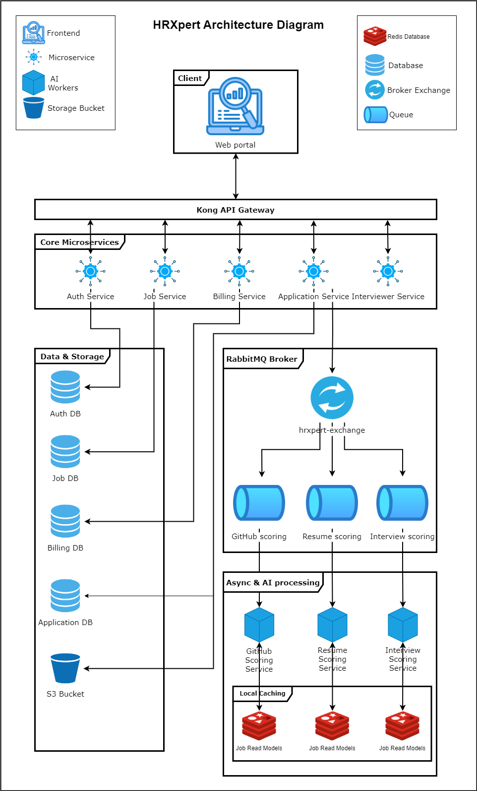
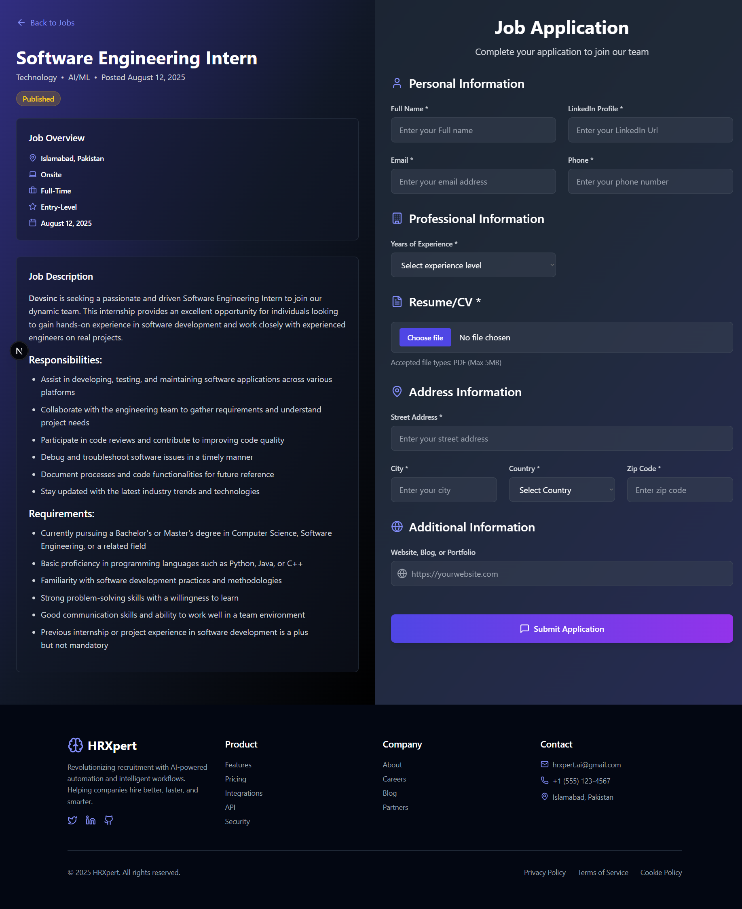
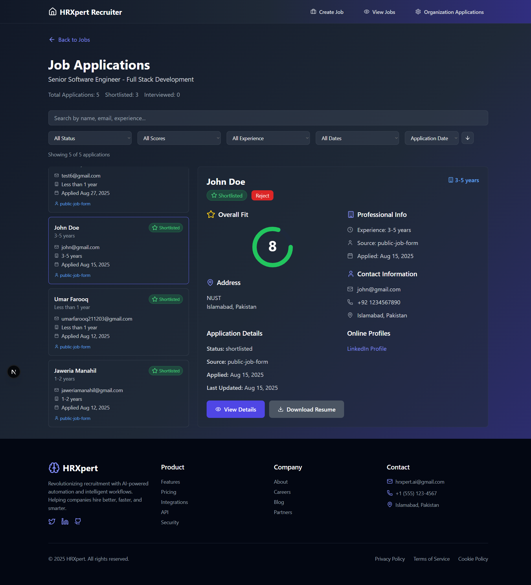

# HRXpert - Automating Talent Acquisition using Artificial Intelligence

**HRXpert** is an AI-powered recruitment intelligence platform designed to automate, augment, and scale modern hiring workflows using intelligent, agent-driven systems.

---

## 🏢 Overview

- **name:** HRXpert - Automating Talent Acquisition using Artificial Intelligence
- **Domain:** HR Tech, AI Automation, Recruitment Systems  
- **Focus:** End-to-end hiring automation with production-grade AI

---

## 🚀 What We Build

- AI-based resume screening and ranking  
- Autoamted Real-time AI interviewers  
- Intelligent job–candidate matching  
- Recruitment workflow automation  
- Scalable hiring microservices  
- Automated Scheduling and Notifications  

---

## 🏗 System Architecture

### System Design
- Microservices-based backend
- Dedicated AI inference & orchestration layer
- Event-driven async pipelines
- Cloud-ready and horizontally scalable

---

---

## 🧠 AI Capabilities

### Resume Intelligence
- Embedding-based resume indexing
- Semantic job–resume matching
- Configurable scoring criteria
- Bias-aware ranking logic

### Automated AI Interviews
- Adaptive question generation
- Multi-stage agentic interviews
- Real-time voice & text interaction
- Structured evaluation & scoring

### Agentic Workflows
- Context-aware interview flows
- Tool-calling and orchestration
- Human-in-the-loop support

---

## ⚙ Tech Stack

### Backend
- FastAPI
- NestJS

### AI / ML
- LLMs (OpenAI / Gemini)
- LangChain, LangGraph
- Real-time Audio APIs (OpenAI / Gemini)

### Frontend
- Next.js
- Tailwind CSS

### Infrastructure
- Docker
- Cloud-native deployment
- Async workers & queues
- AWS S3 Buckets
---

## 🔐 Roles & Access Model

- **Admin Recruiter** – Organization & workflow control  
- **Recruiter** – Hiring, interviews, evaluations  
- **Interviewer** – Interviews and scores  
- **Candidate** – Job Portal & Applications   

---

## 🖥 Product UI

### Application Viewer & AI Evaluations Page 

### Application Page

### Job Applications Page

### Job Management

### Job Page

### Signup Page

---

**HRXpert — Redefining recruitment with intelligent automation.**
